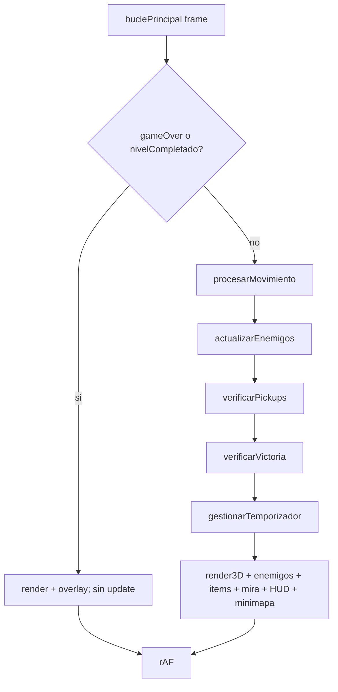

# API / Internal Function Contract — Puerta de Salida

> No hay API HTTP. El "contrato de API" es la **interfaz interna de funciones** de `motor.js`:
> firmas, contratos de entrada/salida y los puntos de integración exactos (línea de referencia
> sobre el `motor.js` actual de 1381 líneas).

---

## 1. Funciones MODIFICADAS

### `lanzarRayoDDA(anguloRayo) → { dist, u, side, tipo }`
- **Cambio:** la condición de impacto pasa de `tipo === 'pared'` a `tipo === 'pared' || tipo === 'salida'`.
- **Cambio:** el objeto devuelto **añade `tipo`** (`'pared'` | `'salida'`) de la celda impactada.
- **Punto de integración:** bucle `while(!hit)` (≈ línea 506) y `return` (≈ línea 524).
- **Contrato:** retrocompatible — los consumidores que ignoran `tipo` no se rompen.

### `esCamino(x, y) → boolean`
- **Cambio:** retorna `true` también para `tipo === 'salida'` (la celda de salida es transitable).
- **Contrato:** `return tipo === 'camino' || tipo === 'salida'`.
- **Punto de integración:** ≈ línea 1304.

### `inicializar() → void`
- **Cambios:**
  1. Resetea las nuevas variables de estado (`nivelCompletado=false`, `temporizadorActivo=false`,
     `temporizadorFinMs=0`).
  2. Tras generar el mapa y antes de construir `libres`, invoca `colocarSalida()`.
  3. Guarda `numEnemigosInicial = N`.
  4. **Excluye** la celda de salida de `libres` (no debe spawnear enemigos/items sobre la puerta).
- **Punto de integración:** cuerpo de `inicializar()` (≈ líneas 392–458).

### `renderizar3D() → void`
- **Cambio:** cuando `resultado.tipo === 'salida'`, la columna se pinta en **cian pulsante** en lugar
  de la textura de muro (ver contrato UI). Resto de la lógica intacta.
- **Punto de integración:** bloque de dibujo de pared (≈ líneas 578–595).

### `renderizarHUD() → void`
- **Cambio 1:** **eliminar** el bloque `if (enemigos.length === 0) { '¡ZONA DESPEJADA!' … return; }`
  (≈ líneas 1133–1145) — esa pseudo-victoria por limpiar el mapa queda **obsoleta**.
- **Cambio 2:** añadir overlay de victoria si `nivelCompletado` (ver UI).
- **Cambio 3:** añadir indicador de cuenta atrás si `temporizadorActivo` (ver UI).

### `renderizarMinimapa() → void`
- **Cambio:** la celda `tipo==='salida'` se pinta en `#00ffff` (≈ línea 1210, extender el ternario).

### `buclePrincipal() → void`
- **Cambio:** antes de `requestAnimationFrame`, dentro de la rama de juego activo, invocar la lógica de
  estado: `verificarVictoria()` y `gestionarTemporizador()`. Si `nivelCompletado`, comportarse como
  `gameOver` (renderizar + overlay, **sin** actualizar jugador/enemigos).
- **Punto de integración:** ≈ líneas 1351–1377.

## 2. Funciones NUEVAS

### `colocarSalida() → void`
- **Pre:** `laberinto.mapa` ya generado; `jugador` en `1.5,1.5`.
- **Post:** la celda `'camino'` más lejana del spawn (BFS de pasos) pasa a `tipo:'salida'`; se asigna
  `laberinto.salida = {f, c}`.
- **Contrato:** BFS desde celda `(1,1)` sobre vecinos transitables; elige `argmax(distancia)`;
  tie-break determinista (primera encontrada a distancia máxima). Nunca elige el spawn.

### `verificarVictoria() → void`
- **Contrato:** si `Math.floor(jugador.y) === laberinto.salida.f && Math.floor(jugador.x) === laberinto.salida.c`
  ⇒ `nivelCompletado = true` (y `temporizadorActivo = false`).
- Es la **única** vía de victoria (RF-5, AC-7).

### `gestionarTemporizador() → void`
- **Contrato (orden):**
  1. Si `nivelCompletado || gameOver` ⇒ no-op.
  2. Si `enemigos.length === 0 && !temporizadorActivo` ⇒ arrancar: `temporizadorActivo=true`,
     `temporizadorFinMs = performance.now() + TIEMPO_BUSQUEDA_MS`.
  3. Si `temporizadorActivo && performance.now() >= temporizadorFinMs` ⇒ `reaparecerEnemigos(numEnemigosInicial)`,
     `temporizadorActivo=false`.
- **Invariante:** `temporizadorActivo ⇒ enemigos.length === 0`.

### `reaparecerEnemigos(n) → void`
- **Pre:** `n ≥ 1`.
- **Post:** se añaden `n` enemigos al array `enemigos`, en celdas `'camino'` libres al azar a
  distancia `> 3` del jugador (misma regla que el spawn inicial), con la forma de objeto enemigo
  existente (`{x,y,targetX,targetY,lastDx,lastDy,chasing}`).
- **Nota de refactor:** la lógica de selección de celdas libres + barajado está **inlined** en
  `inicializar()` (≈ líneas 419–444). Debe **extraerse** a un helper reutilizable
  (p. ej. `celdasLibresLejanas()` / `crearEnemigo(pos)`) que consuman tanto `inicializar()` como
  `reaparecerEnemigos()`. **No duplicar** la lógica.

## 3. Diagrama de flujo (frame de juego)

