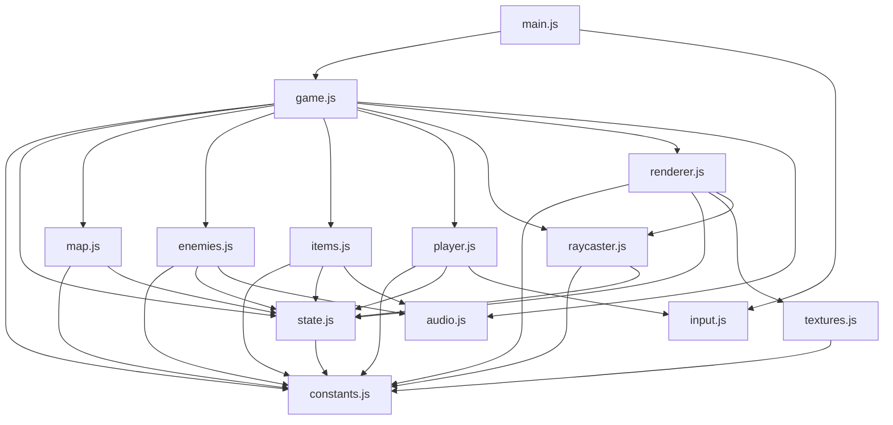

# API Contract — Refactor: Módulos ES6
## Spec: `refactor-and-best-practices`

> En este proyecto no existen endpoints HTTP. El "API" es la **interfaz pública** de cada módulo ES6:
> qué exporta, qué importa, y las invariantes de cada contrato.

---

## Grafo de dependencias (DAG)



**Regla**: ninguna arista apunta de vuelta hacia un nodo antecesor. `state.js` no importa lógica.

---

## Módulo: `src/constants.js`

**Importa:** nada

**Exporta:**

| Símbolo | Tipo | Valor original | Descripción |
|---------|------|---------------|-------------|
| `FOV` | `number` | `Math.PI / 3` | Campo de visión en radianes |
| `RENDER_DIST` | `number` | `30` | Distancia máxima de render |
| `TEX_SIZE` | `number` | `64` | Tamaño de textura en píxeles |
| `ANCHO_3D` | `number` | `640` | Ancho del área 3D en canvas |
| `ANCHO_MAPA` | `number` | `320` | Ancho del minimapa en canvas |
| `ALTO` | `number` | `480` | Alto total del canvas |
| `MITAD_ALTO` | `number` | `ALTO / 2` | Horizonte vertical |
| `COOLDOWN_DISPARO` | `number` | `22` | Frames de cooldown pistola |
| `COOLDOWN_AMETRALLADORA` | `number` | `6` | Frames de cooldown ametralladora |
| `ENEMY_SPEED` | `number` | `0.04` | Velocidad patrulla enemigo |
| `ENEMY_CHASE_SPEED` | `number` | `0.06` | Velocidad persecución |
| `ENEMY_CHASE_RANGE` | `number` | `8` | Rango de persecución (unidades) |
| `ENEMY_MIN_DIST` | `number` | `1.2` | Distancia mínima antes de atacar |
| `ENEMY_DAMAGE` | `number` | `8` | Daño por ataque enemigo |
| `ENEMY_ATTACK_COOLDOWN` | `number` | `30` | Frames entre ataques |
| `SHADE_DIVISOR` | `number` | `13` | Divisor para degradado de distancia |
| `FACE_DARKEN_FACTOR` | `number` | `0.18` | Factor oscurecimiento cara lateral |
| `PLAYER_MOVE_SPEED` | `number` | `0.08` | Velocidad de traslación |
| `PLAYER_ROT_SPEED` | `number` | `0.05` | Velocidad de rotación |
| `PLAYER_COLLISION_RADIUS` | `number` | `0.2` | Radio colisión del jugador |
| `PLAYER_MAX_HP` | `number` | `100` | Puntos de vida máximos |
| `SPRITE_NEAR_CLIP` | `number` | `0.3` | Distancia mínima de sprite |
| `SPRITE_CORRECTION_NEAR` | `number` | `0.1` | Corrección perspectiva sprite |
| `MUZZLE_FLASH_DURATION` | `number` | `4` | Frames del flash de disparo |
| `HIT_MARKER_DURATION` | `number` | `8` | Frames del marcador de impacto |
| `DAMAGE_FLASH_DURATION` | `number` | `6` | Frames del flash de daño |
| `ITEM_PICKUP_DIST` | `number` | `0.6` | Radio de recogida de ítems |
| `SALUD_ITEMS_MAX` | `number` | `3` | Máximo de ítems de salud por mapa |
| `SALUD_RECUPERACION` | `number` | `25` | HP restaurado por ítem de salud |
| `ITEM_FLOAT_SPEED` | `number` | `0.003` | Velocidad de flotación de ítems |
| `TIEMPO_BUSQUEDA_MS` | `number` | `30000` | Temporizador de búsqueda (ms) |
| `SALIDA_COLOR` | `number[]` | `[0,255,255]` | Color RGB de la salida |
| `SALIDA_PULSO_HZ` | `number` | `3` | Frecuencia de pulso de la salida (Hz) |

---

## Módulo: `src/audio.js`

**Importa:** nada

**Exporta:**

| Función | Firma | Descripción |
|---------|-------|-------------|
| `ensureAudioCtx` | `() → void` | Inicializa/resume el AudioContext (llamar antes de play*) |
| `playShoot` | `() → void` | Sonido de disparo (pistola/ametralladora) |
| `playHit` | `() → void` | Sonido de impacto en enemigo |
| `playEnemyAlert` | `() → void` | Sonido de alerta de enemigo |
| `playDamage` | `() → void` | Sonido de daño al jugador |
| `playPickup` | `() → void` | Sonido de recogida de salud |
| `playPickupWeapon` | `() → void` | Sonido de recogida de arma |

**Invariante**: `audioCtx` es variable privada del módulo. Nunca se exporta directamente.

---

## Módulo: `src/input.js`

**Importa:** nada

**Exporta:**

| Símbolo | Tipo | Descripción |
|---------|------|-------------|
| `teclasPresionadas` | `Set<string>` | Teclas actualmente presionadas |
| `onDisparo` | `(callback: () → void) → void` | Registra callback para tecla ESPACIO |
| `onReinicio` | `(callback: () → void) → void` | Registra callback para tecla R |

**Invariante**: los event listeners `keydown`/`keyup` se registran una única vez en este módulo.

---

## Módulo: `src/textures.js`

**Importa:** `constants.js` → `{ TEX_SIZE }`

**Exporta:**

| Símbolo | Tipo | Descripción |
|---------|------|-------------|
| `muroTexData` | `Uint8ClampedArray` | Pixel data RGBA de la textura de muro (64×64) |
| `techoTexData` | `Uint8ClampedArray` | Pixel data RGBA de la textura de techo (64×64) |
| `sueloTexData` | `Uint8ClampedArray` | Pixel data RGBA de la textura de suelo (64×64) |

**Invariante**: las texturas se generan una única vez al cargar el módulo (top-level). Son inmutables desde la perspectiva de los consumidores.

---

## Módulo: `src/state.js`

**Importa:** `constants.js` → `{ PLAYER_MAX_HP }`

**Exporta:**

```js
export const state = {
  // Entidades vivas (ver db_refactor-and-best-practices.md para esquemas)
  laberinto: null,        // { mapa[][], filas, columnas, salida }
  jugador: null,          // { x, y, angulo }
  enemigos: [],           // Enemy[]
  items: [],              // Item[]

  // Contadores de partida
  kills: 0,
  playerHP: PLAYER_MAX_HP,

  // Timers de frame (cuentan hacia abajo cada tick)
  cooldownDisparo: 0,
  enemyAttackTimer: 0,
  muzzleFlashTimer: 0,
  hitMarkerTimer: 0,
  damageFlashTimer: 0,

  // Flags de estado de partida
  gameOver: false,
  nivelCompletado: false,
  tieneAmetralladora: false,
  numEnemigosInicial: 0,

  // Temporizador de búsqueda
  temporizadorActivo: false,
  temporizadorFinMs: 0,
};
```

**Invariante**: `state` es el único objeto mutable global del juego. Ningún módulo declara estado global propio; importa y muta `state` directamente.

---

## Módulo: `src/map.js`

**Importa:** `constants.js`, `state.js` → `{ state }`

**Exporta:**

| Función | Firma | Descripción |
|---------|-------|-------------|
| `generarMapa` | `(filasCeldas: number, colsCeldas: number) → { grid, filas, cols }` | Genera laberinto por DFS-backtracker |
| `colocarSalida` | `() → void` | BFS desde spawn; marca celda más lejana como `'salida'`; escribe `state.laberinto.salida` |
| `celdasLibresLejanas` | `(posX, posY, minDist) → {x,y}[]` | Celdas `'camino'` barajadas a distancia > minDist del punto dado |

---

## Módulo: `src/raycaster.js`

**Importa:** `constants.js`, `state.js` → `{ state }`

**Exporta:**

| Símbolo | Tipo | Descripción |
|---------|------|-------------|
| `zBuffer` | `Float64Array(ANCHO_3D)` | Distancias perpendiculares por columna; llenado cada frame por renderer |
| `rayCache` | `{angulo, dist}[]` | Rayos lanzados; llenado cada frame por renderer; consumido por minimapa |
| `lanzarRayoDDA` | `(anguloRayo: number) → {dist, u, side, tipo}` | DDA raycasting; retorna distancia perp, coord de textura u, lado impactado, tipo de celda |

---

## Módulo: `src/player.js`

**Importa:** `constants.js`, `state.js` → `{ state }`, `input.js` → `{ teclasPresionadas }`

**Exporta:**

| Función | Firma | Descripción |
|---------|-------|-------------|
| `esCamino` | `(x: number, y: number) → boolean` | Devuelve true si la celda en (x,y) es transitable (`'camino'` o `'salida'`) |
| `procesarMovimiento` | `() → void` | Lee `teclasPresionadas`, aplica movimiento con wall-sliding a `state.jugador` |

---

## Módulo: `src/enemies.js`

**Importa:** `constants.js`, `state.js` → `{ state }`, `audio.js`

**Exporta:**

| Función | Firma | Descripción |
|---------|-------|-------------|
| `esLineaLibre` | `(x1,y1,x2,y2) → boolean` | Traza rayo de visión; retorna true si no hay paredes |
| `elegirSiguienteCelda` | `(e: Enemy) → void` | Elige próxima celda objetivo del enemigo en patrulla |
| `actualizarEnemigos` | `() → void` | Actualiza posición de todos los enemigos; aplica daño al jugador si contacto |
| `reaparecerEnemigos` | `(n: number) → void` | Añade n enemigos nuevos en celdas lejanas al jugador |

---

## Módulo: `src/items.js`

**Importa:** `constants.js`, `state.js` → `{ state }`, `audio.js`

**Exporta:**

| Función | Firma | Descripción |
|---------|-------|-------------|
| `verificarPickups` | `() → void` | Comprueba distancia jugador-ítem; activa efecto y desactiva el ítem |

---

## Módulo: `src/renderer.js`

**Importa:** `constants.js`, `state.js` → `{ state }`, `textures.js`, `raycaster.js` → `{ lanzarRayoDDA, zBuffer, rayCache }`

**Exporta:**

| Función | Firma | Descripción |
|---------|-------|-------------|
| `renderizar3D` | `() → void` | Rellena frameBuffer (suelo/techo/paredes), llama lanzarRayoDDA, putImageData, overlays |
| `renderizarEnemigos` | `() → void` | Renderiza sprites de enemigos con z-buffer |
| `renderizarItems` | `() → void` | Renderiza sprites de ítems flotantes con z-buffer |
| `renderizarMira` | `() → void` | Dibuja la mira (crosshair) y hit marker |
| `renderizarHUD` | `() → void` | Dibuja HP, kills, arma, cooldown, temporizador; overlays game-over/victoria |
| `renderizarMinimapa` | `() → void` | Dibuja el minimapa en la zona derecha del canvas (offsetX=640) |

**Setup interno**: el módulo declara `canvas`, `ctx`, `frameBuffer`, `buf` como variables top-level. No los exporta (son detalle de implementación).

---

## Módulo: `src/game.js`

**Importa:** todos los módulos anteriores

**Exporta:**

| Función | Firma | Descripción |
|---------|-------|-------------|
| `inicializar` | `() → void` | Resetea state completo, genera mapa, coloca salida, spawna jugador/enemigos/ítems |
| `buclePrincipal` | `() → void` | Game loop: decremente timers, update lógica, render, `requestAnimationFrame` |

---

## Módulo: `src/main.js`

**Importa:** `game.js` → `{ inicializar, buclePrincipal }`, `input.js` → `{ onDisparo, onReinicio }`

**Exporta:** nada (es el punto de entrada)

**Contenido esperado:**
```js
import { inicializar, buclePrincipal } from './game.js';
import { onDisparo, onReinicio } from './input.js';
import { disparar } from './game.js';

onDisparo(disparar);
onReinicio(inicializar);

inicializar();
buclePrincipal();
```

> **Invariante RF-4**: `main.js` no contiene lógica de juego. Solo importaciones y llamadas de arranque.

---

## Contrato de `index.html`

Solo se modifica la etiqueta `<script>`:

```html
<!-- ANTES -->
<script src="motor.js"></script>

<!-- DESPUÉS -->
<script type="module" src="src/main.js"></script>
```

Ningún otro cambio en `index.html`.
